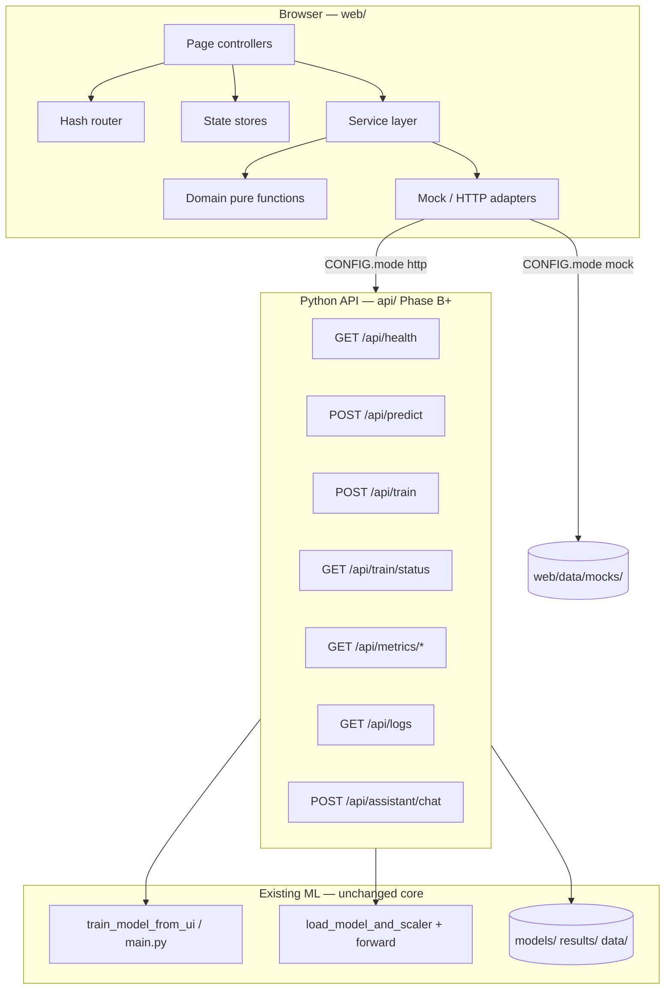
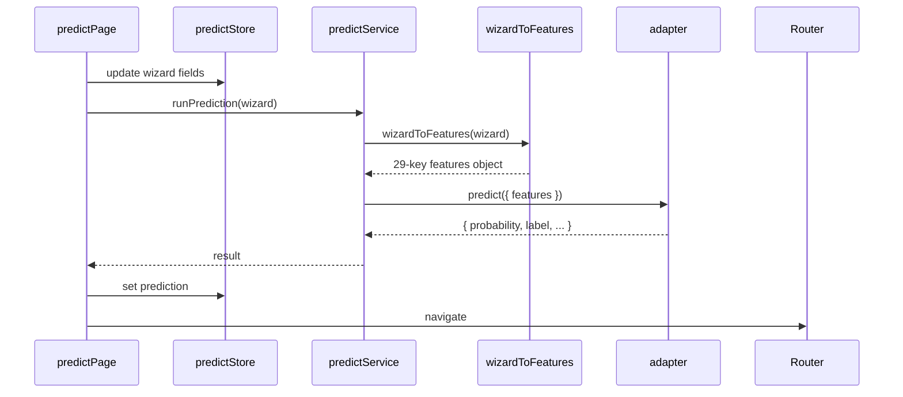

# Architecture Plan: CardioFL Web (Vanilla HTML/CSS/JS)

**Step:** 2 — Target architecture (design only)  
**Based on:** `MIGRATION_AUDIT.md`  
**Stack:** HTML5, modular CSS, ES modules (no framework)  
**Backend (future):** Python HTTP API over existing PyTorch/FL pipeline  
**Version:** 2.0 — 2026-05-20

---

## 1. Architecture Decision Record

| Decision | Choice | Rationale |
|----------|--------|-----------|
| App structure | **Hash SPA** (`index.html` + `#/route`) | Single shell (sidebar + main); static hosting; maps 5 Streamlit tabs + 3 new surfaces |
| Alternative | Multi-page HTML (`pages/*.html`) | Optional; see §14 — higher duplication cost |
| Styling | **CSS custom properties** + BEM-like `.c-*` / `.p-*` | Tokens in `UI_TOKENS.md` → `web/css/tokens.css` |
| JavaScript | **Native ES modules** | No bundler required for Phases A–C |
| Charts | **Chart.js** (lazy via `chartLoader.js`) | Replaces `st.line_chart` + static PNG gallery |
| Data access | **Services → Adapters** | `mock` reads `web/data/mocks/`; `http` calls `/api/*` |
| State | **Custom pub/sub stores** | Mirrors minimal Streamlit session + wizard |
| Encoding | **`encoding-manifest.json`** | **Training `LabelEncoder` codes only** — not Streamlit `CAT_ENCODE` (audit §7, R3) |

---

## 2. High-Level System Diagram



**Rule:** Page modules never import `fetch` directly and never import PyTorch. All ML stays server-side.

---

## 3. Streamlit → Web Route Map

| Streamlit | Hash route | Page module | Phase |
|-----------|------------|-------------|-------|
| Tab 0 Predict | `#/predict` | `predictPage.js` | B |
| Tab 0 result (inline) | `#/predict/result` | `predictResultPage.js` | B |
| Tab 1 Train | `#/train` | `trainPage.js` | B |
| Tab 2 Performance | `#/analytics` | `analyticsPage.js` | C |
| Tab 3 Training Logs (metrics table/chart) | `#/analytics` + metrics APIs | shared charts | C |
| Tab 3 (activity-style feed) | `#/logs` | `logsPage.js` | D |
| Tab 4 About FL | `#/settings` (Privacy section) | `settingsPage.js` | D |
| Sidebar privacy / hospitals | `#/dashboard` + `#/settings` | `dashboardPage.js`, sidebar | A/D |
| *(new)* KPI landing | `#/dashboard` | `dashboardPage.js` | C |
| *(new)* AI chat | `#/assistant` | `assistantPage.js` | D |

**Route guards:**
- `#/predict/result` → redirect to `#/predict` if `predictStore.prediction` is null
- `#/predict` → show `MODEL_NOT_FOUND` banner when API returns 404 (Streamlit parity)

**Default route:** `#/` and unknown hashes → `#/dashboard`

---

## 4. Proposed Folder Structure

Legend: **✅** exists (Phase A partial) · **⬜** scaffold / Phase B+ · **📄** doc-only stub

```
heart_disease-main/
├── MIGRATION_AUDIT.md
├── ARCHITECTURE_PLAN.md          ← this file
├── UI_TOKENS.md
│
├── api/                          ⬜ Phase B — Python FastAPI
│   ├── README.md                 ✅
│   ├── main.py                   ⬜
│   ├── config.py                 ⬜
│   ├── routers/
│   │   ├── health.py
│   │   ├── predict.py
│   │   ├── train.py
│   │   ├── metrics.py
│   │   ├── logs.py
│   │   └── assistant.py
│   └── services/
│       ├── inference.py          ← load_model_and_scaler logic
│       ├── training.py           ← train_model_from_ui logic
│       └── encoding.py           ← loads encoding-manifest.json
│
├── web/
│   ├── index.html                ✅ App shell
│   ├── README.md                 ✅
│   │
│   ├── assets/
│   │   ├── icons/                ⬜ SVG sprites
│   │   └── fonts/                ⬜ optional self-hosted Inter
│   │
│   ├── css/
│   │   ├── tokens.css            ✅ from UI_TOKENS.md
│   │   ├── base.css              ✅
│   │   ├── layout.css            ✅
│   │   ├── utilities.css         ✅
│   │   ├── components/
│   │   │   ├── sidebar.css       ✅
│   │   │   ├── card.css          ✅
│   │   │   ├── page-header.css   ✅
│   │   │   ├── button.css        ✅
│   │   │   ├── metric-card.css   ⬜
│   │   │   ├── form-controls.css ⬜
│   │   │   ├── stepper.css       ⬜
│   │   │   ├── toggle.css        ⬜
│   │   │   ├── slider.css        ⬜
│   │   │   ├── chart-container.css ⬜
│   │   │   ├── log-item.css      ⬜
│   │   │   ├── chat.css          ⬜
│   │   │   └── network-diagram.css ⬜
│   │   └── pages/
│   │       ├── pages.css         ✅ shared
│   │       ├── dashboard.css     ✅
│   │       ├── predict.css       ⬜
│   │       ├── train.css         ⬜
│   │       ├── analytics.css     ⬜
│   │       ├── logs.css          ⬜
│   │       ├── assistant.css     ⬜
│   │       └── settings.css      ⬜
│   │
│   ├── js/
│   │   ├── main.js               ✅ bootstrap
│   │   ├── config.js             ✅ mode + apiBaseUrl
│   │   ├── router/
│   │   │   ├── router.js         ✅
│   │   │   └── routes.js         ✅ (+ predict/result in Phase B)
│   │   ├── state/
│   │   │   ├── store.js          ⬜ createStore factory
│   │   │   ├── appStore.js       ⬜
│   │   │   ├── predictStore.js   ⬜
│   │   │   ├── trainStore.js     ⬜
│   │   │   └── settingsStore.js  ⬜
│   │   ├── services/
│   │   │   ├── apiClient.js      ⬜
│   │   │   ├── predictService.js ⬜
│   │   │   ├── trainService.js   ⬜
│   │   │   ├── metricsService.js ⬜
│   │   │   ├── logsService.js    ⬜
│   │   │   └── assistantService.js ⬜
│   │   ├── adapters/
│   │   │   ├── index.js          ⬜ getAdapter()
│   │   │   ├── adapterTypes.js   ⬜ JSDoc contracts
│   │   │   ├── mockAdapter.js    ⬜
│   │   │   └── httpAdapter.js    ⬜
│   │   ├── domain/
│   │   │   ├── featureDefaults.js    ⬜
│   │   │   ├── wizardToFeatures.js   ⬜
│   │   │   ├── riskPresentation.js   ⬜
│   │   │   └── validation.js         ⬜
│   │   ├── components/
│   │   │   ├── sidebar.js        ✅
│   │   │   ├── pageHeader.js     ✅
│   │   │   ├── metricCard.js     ⬜
│   │   │   ├── stepper.js        ⬜
│   │   │   ├── segmentControl.js ⬜
│   │   │   ├── rangeSlider.js    ⬜
│   │   │   ├── toggleSwitch.js   ⬜
│   │   │   ├── confusionMatrix.js ⬜
│   │   │   ├── hospitalNodeList.js ⬜
│   │   │   └── privacyBanner.js  ⬜
│   │   ├── pages/
│   │   │   ├── dashboardPage.js  ✅ partial
│   │   │   ├── predictPage.js    ✅ placeholder
│   │   │   ├── predictResultPage.js ⬜
│   │   │   ├── trainPage.js      ✅ placeholder
│   │   │   ├── analyticsPage.js  ✅ placeholder
│   │   │   ├── logsPage.js       ✅ placeholder
│   │   │   ├── assistantPage.js  ✅ placeholder
│   │   │   └── settingsPage.js   ✅ placeholder
│   │   ├── charts/
│   │   │   ├── chartLoader.js    ✅
│   │   │   ├── trainingAccuracyChart.js ✅
│   │   │   ├── weeklyPredictionsChart.js ✅
│   │   │   ├── lossCurveChart.js ⬜
│   │   │   ├── rocChart.js       ⬜
│   │   │   └── radarChart.js     ⬜
│   │   └── utils/
│   │       ├── icons.js          ✅
│   │       ├── dom.js            ⬜
│   │       ├── format.js         ⬜
│   │       └── storage.js        ⬜
│   │
│   └── data/
│       ├── encoding-manifest.json  📄 schema + training codes (Phase B fill)
│       └── mocks/
│           ├── dashboard.json      ✅
│           ├── round-logs.json     ⬜
│           ├── final-summary.json  ⬜
│           ├── feature-importance.json ⬜
│           ├── activity-logs.json  ⬜
│           └── assistant-replies.json ⬜
│
└── streamlit_app/                Legacy until parity sign-off
    └── app.py
```

---

## 5. Component Map

### 5.1 Shell and layout

| Component | CSS | JS | Responsibility |
|-----------|-----|-----|----------------|
| **AppShell** | `layout.css` | `index.html` | `.app` grid: sidebar + main + mobile overlay |
| **Sidebar** | `sidebar.css` | `sidebar.js` | Brand, 7 nav links, active hash, footer status |
| **PageHeader** | `page-header.css` | `pageHeader.js` | Title + subtitle per route |
| **PageRoot** | — | `router.js` | `#app-root` mount/unmount lifecycle |

### 5.2 Dashboard (`#/dashboard`)

| Component | Maps from Streamlit |
|-----------|---------------------|
| **MetricCard** | New KPIs + derived from `round_logs` / `final_summary` |
| **NetworkDiagram** | Sidebar “5 hospitals connected” (dynamic after train) |
| **ChartPanel** | Tab 3 loss chart + Tab 2 training curves (live) |
| **PrivacyStrip** | Sidebar privacy `st.info` (short form) |

### 5.3 Predict Risk (`#/predict`) — Tab 0

| Component | Step | Streamlit widget equivalent |
|-----------|------|----------------------------|
| **Stepper** | 1–4 | 3-column single form → wizard |
| **FormSection** | 1–3 | `st.markdown` section groups |
| **RangeSlider** | all | `st.slider`, `st.number_input` |
| **SegmentControl** | 1–3 | `st.selectbox`, `st.checkbox` |
| **ReviewGrid** | 4 | — (new) |
| **PrivacyBanner** | 4 | Sidebar privacy copy |
| **NavBar** | — | Back / Next / Predict |

**Wizard vs 29 features:** Steps collect a **subset**; `wizardToFeatures.js` fills remaining keys from `encoding-manifest.json` → `wizard_defaults`.

### 5.4 Predict Result (`#/predict/result`)

| Component | Streamlit parity |
|-----------|------------------|
| **RiskGauge** | Colored banner + `st.progress` |
| **RiskLabel** | HIGH/LOW at 0.5 |
| **ClinicalMessage** | `st.warning` / `st.success` |
| **FactorBarList** | *(enhancement — mock until API)* |
| **ButtonGroup** | New prediction / dashboard |

### 5.5 Train Model (`#/train`) — Tab 1

| Component | Streamlit parity |
|-----------|------------------|
| **PresetRadio** | Demo / Balanced / Full |
| **RangeSlider** | rounds, epochs, hospitals |
| **ToggleSwitch** | noniid, dp |
| **NumberInput** | seed |
| **ConfirmCheckbox** | allow_train |
| **TrainingProgress** | `st.progress` + status |
| **HospitalNodeList** | Sidebar hospitals (live) |
| **ChartPanel** | loss during poll |

### 5.6 Analytics (`#/analytics`) — Tab 2 + Tab 3 metrics

| Component | Streamlit parity |
|-----------|------------------|
| **MetricCard** | Hidden table cols: accuracy, precision, recall, f1 |
| **ConfusionMatrix** | `02_fed_confusion_matrix.png` data |
| **ChartPanel** | Training curves, feature importance |
| **DataTable** | Round logs dataframe |
| **StaticPlotFallback** | Optional PNG if JSON missing |

### 5.7 Logs (`#/logs`) — new activity feed

| Component | Notes |
|-----------|-------|
| **FilterTabs** | All / Predictions / Training / Errors |
| **LogItem** | Not in Streamlit |
| **ToolbarButton** | Export stub |

### 5.8 AI Assistant (`#/assistant`) — new

| Component | Notes |
|-----------|-------|
| **ChatMessage** | Mock → `POST /api/assistant/chat` |
| **SuggestedPrompts** | Static list |
| **ChatInput** | Text + send |
| **DisclaimerBar** | Medical disclaimer |

### 5.9 Settings (`#/settings`) — Tab 4 + sidebar

| Component | Streamlit source |
|-----------|------------------|
| **SettingsSection** | About FL markdown sections |
| **ToggleSwitch** | New UX prefs |
| **PrivacyDoc** | Tab 4 + sidebar HIPAA copy |
| **ThemeToggle** | `data-theme` on `<html>` |

---

## 6. State Management Strategy

### 6.1 Principles

1. **Pages → Services → Adapters** — no adapter imports in pages.
2. **Domain layer is pure** — no `document`, no `fetch`.
3. **Persist only what Streamlit implied or UX requires.**
4. **Immutable merges** on `setState` for predictable debugging.
5. **Subscribe in `mount()`, unsubscribe in `unmount()`** to avoid leaks.

### 6.2 Store factory (`js/state/store.js`)

```js
/**
 * @template T
 * @param {T} initialState
 */
export function createStore(initialState) {
  let state = structuredClone(initialState);
  const listeners = new Set();

  return {
    getState: () => state,
    subscribe: (fn) => { listeners.add(fn); return () => listeners.delete(fn); },
    setState: (partial) => {
      state = { ...state, ...partial };
      listeners.forEach((fn) => fn(state));
    },
    reset: () => { state = structuredClone(initialState); listeners.forEach((fn) => fn(state)); },
  };
}
```

### 6.3 Store inventory

| Store | Persistence | Key fields | Streamlit equivalent |
|-------|-------------|------------|----------------------|
| **appStore** | `sessionStorage` | `lastTrainedAt`, `modelVersion`, `hospitalsCount` | `last_trained_at` |
| **predictStore** | `sessionStorage` | `step`, `wizard`, `prediction`, `errors` | Tab 0 widgets + result |
| **trainStore** | memory | `config`, `jobId`, `status`, `progress`, `roundLogs` | Tab 1 + progress callback |
| **settingsStore** | `localStorage` | `theme`, `notifications`, `aiSensitivity` | New |
| **uiStore** | memory | `sidebarOpen`, `activeRoute`, `toasts` | N/A |

### 6.4 `predictStore` shape

```js
{
  step: 1,
  wizard: {
    basic: { age, gender, bmi, familyHistory },
    medical: { diabetes, hypertension, previousHeartEvent, cholesterolTotal, ecgResult, bloodPressureSystolic },
    lifestyle: { smokingStatus, alcoholUnitsPerWeek, sleepHoursPerNight, exerciseHoursPerWeek, stressLevel, dietQuality, saltIntake },
  },
  prediction: null,
  isSubmitting: false,
  errors: {},
}
```

### 6.5 `trainStore` shape

```js
{
  preset: "balanced",
  config: { rounds, epochs, hospitals, noniid, dp, seed },
  jobId: null,
  status: "idle",       // idle | queued | running | completed | failed
  progress: { pct: 0, message: "" },
  confirmTraining: true,
}
```

### 6.6 Data flow (predict)



---

## 7. API / Service Layer Contract

### 7.1 Configuration (`js/config.js`)

```js
export const CONFIG = {
  mode: "mock",                    // "mock" | "http"
  apiBaseUrl: "http://localhost:8000",
  pollIntervalMs: 1500,
  requestTimeoutMs: 300000,
};
```

### 7.2 Adapter selection (`js/adapters/index.js`)

```js
import { CONFIG } from "../config.js";
import { mockAdapter } from "./mockAdapter.js";
import { httpAdapter } from "./httpAdapter.js";

export function getAdapter() {
  return CONFIG.mode === "http" ? httpAdapter : mockAdapter;
}
```

### 7.3 Service → adapter method matrix

| Service module | Methods | Mock source | HTTP |
|----------------|---------|-------------|------|
| `predictService` | `runPrediction(wizard)` | formula / JSON | `POST /api/predict` |
| `trainService` | `startTraining(config)`, `pollStatus(jobId)` | timer simulation | `POST /api/train`, `GET /api/train/status` |
| `metricsService` | `getRoundLogs()`, `getFinalSummary()`, `getDashboardMetrics()` | `data/mocks/*.json` | `GET /api/metrics/*` |
| `logsService` | `getActivityLogs(filter, page)` | `activity-logs.json` | `GET /api/logs` |
| `assistantService` | `sendMessage(text, history)` | keyword map | `POST /api/assistant/chat` |
| `apiClient` | `get`, `post`, `handleError` | — | shared fetch wrapper |

### 7.4 `POST /api/predict`

**Request:**
```json
{
  "features": {
    "age": 55,
    "gender": 1,
    "bmi": 26.0
  }
}
```
All 29 keys required; numeric codes from `encoding-manifest.json` (training-aligned).

**Response (Streamlit parity + extensions):**
```json
{
  "probability": 0.68,
  "risk_pct": 68.0,
  "label": "HIGH",
  "threshold": 0.5,
  "model_version": "2026-05-20T14:17:42",
  "message": "Clinical recommendation text",
  "confidence": null,
  "factor_contributions": []
}
```

### 7.5 `POST /api/train`

**Request:**
```json
{
  "preset": "balanced",
  "rounds": 5,
  "epochs": 3,
  "hospitals": 5,
  "noniid": true,
  "dp": true,
  "seed": 42
}
```

**Response:** `{ "job_id": "train_abc123", "status": "queued" }`

### 7.6 `GET /api/train/status?job_id=`

```json
{
  "job_id": "train_abc123",
  "status": "running",
  "pct": 0.35,
  "message": "Running federated training rounds...",
  "current_round": 3,
  "total_rounds": 5,
  "trained_at": null
}
```

On `completed`: set `trained_at` (ISO), client updates `appStore.lastTrainedAt`.

### 7.7 Metrics endpoints

| Endpoint | Body | Streamlit source |
|----------|------|------------------|
| `GET /api/metrics/round-logs` | `round_logs.json` array | Tab 3 |
| `GET /api/metrics/summary` | `final_summary.json` | CLI / post-train |
| `GET /api/metrics/dashboard` | KPI aggregate | New dashboard |
| `GET /api/metrics/plots/:name` | PNG bytes (optional) | Tab 2 fallback |

### 7.8 Error contract

```json
{
  "error": {
    "code": "MODEL_NOT_FOUND",
    "message": "Model not found. Please run training first."
  }
}
```

| HTTP | Code | UI |
|------|------|-----|
| 404 | `MODEL_NOT_FOUND` | Predict banner + link to `#/train` |
| 409 | `TRAINING_IN_PROGRESS` | Disable train button |
| 500 | `INTERNAL_ERROR` | Toast |
| 503 | `SERVICE_UNAVAILABLE` | Dev fallback message |

### 7.9 Python API layout (future)

```
api/
  main.py              # FastAPI app, CORS, mount routers
  config.py            # PATHS to models/, results/, encoding-manifest
  routers/             # thin HTTP handlers
  services/
    inference.py       # extract from load_model_and_scaler + forward
    training.py        # extract from train_model_from_ui (background task)
    encoding.py        # validate features against manifest
```

**Background training:** `train_service` runs job in thread/async; status endpoint reads shared job state (replaces blocking Streamlit rerun).

---

## 8. Encoding Manifest (canonical — training pipeline)

**Source of truth:** `LabelEncoder` on `data/heart_disease_federated.csv` — **not** `streamlit_app/app.py` `CAT_ENCODE`.

| Column | Label → code |
|--------|----------------|
| `gender` | Female=0, Male=1, Other=2 |
| `ecg_result` | LVH=0, Normal=1, ST-Abnormality=2 |
| `smoking_status` | Current=0, Former=1, Never=2 |
| `physical_activity_level` | Active=0, Light=1, Moderate=2, Sedentary=3 |
| `sleep_quality` | Fair=0, Good=1, Poor=2 |
| `diet_quality` | Average=0, Healthy=1, Unhealthy=2 |
| `salt_intake` | High=0, Low=1, Medium=2 |

File: `web/data/encoding-manifest.json` — consumed by JS domain layer and Python `api/services/encoding.py`.

**Wizard defaults** (features not in wizard steps): e.g. `hdl_cholesterol: 50`, `ldl_cholesterol: 130`, `blood_pressure_diastolic: 80`, `resting_heart_rate: 72`, `fasting_blood_sugar: 100`, `cigarettes_per_day: 0`, `walks_daily: 0`, `plays_sport: 0`, `depression_anxiety: 0`, `fruit_veg_servings_per_day: 3`.

---

## 9. CSS Architecture

### 9.1 Load order (`index.html`)

1. `tokens.css` → 2. `base.css` → 3. `layout.css` → 4. `utilities.css`  
5. `components/*.css` → 6. `pages/*.css` (all linked in Phase A, or dynamic import later)

### 9.2 Naming

| Pattern | Example |
|---------|---------|
| Component block | `.c-card`, `.c-stepper` |
| Element | `.c-card__title` |
| Modifier | `.c-card--wide`, `.is-active` |
| Page scope | `.p-predict` on `<main>` |

### 9.3 Theming

- Default: `data-theme="dark"` on `<html>`
- `settingsStore.theme` toggles `dark` | `light` — overrides in `tokens.css` `[data-theme="light"]`

---

## 10. Chart Strategy

| Chart ID | Page(s) | Data |
|----------|---------|------|
| `training-accuracy` | dashboard, analytics | `round_logs[].accuracy` |
| `weekly-predictions` | dashboard | mock → future |
| `loss-curve` | train, analytics | `avg_client_loss` |
| `roc-curve` | analytics | API / mock |
| `feature-importance` | analytics | API / mock |
| `risk-gauge` | predict/result | predict response |

**Lifecycle:** `mount()` → `chartLoader.load()` → create; `unmount()` → `chart.destroy()`.

---

## 11. Streamlit → Service Mapping

| Streamlit | Python today | Web service | API route |
|-----------|--------------|-------------|-----------|
| `load_model_and_scaler()` | `app.py` | `predictService` | `POST /api/predict` |
| `train_model_from_ui()` | `app.py` | `trainService` | `POST /api/train` |
| Read `round_logs.json` | filesystem | `metricsService` | `GET /api/metrics/round-logs` |
| `st.image` plots | filesystem | `metricsService` | JSON preferred; PNG optional |
| Sidebar + About | static | `settingsPage` | static content |
| N/A activity log | — | `logsService` | `GET /api/logs` |
| N/A chat | — | `assistantService` | `POST /api/assistant/chat` |

---

## 12. Development Workflow

```bash
# Static UI (mock mode)
cd web && python -m http.server 5500
# → http://localhost:5500/#/dashboard

# API (Phase B+)
cd api && uvicorn main:app --reload --port 8000
# Set CONFIG.mode = "http" in web/js/config.js
```

**CORS:** API allows `http://localhost:5500` in dev. Production: nginx serves `web/` and proxies `/api`.

---

## 13. Implementation Phases (from audit)

| Phase | Architecture focus | Status |
|-------|-------------------|--------|
| **A** | Shell, router, tokens, placeholders | ✅ Partial |
| **B** | Wizard, train UI, services, adapters, API stub, encoding manifest | ⬜ |
| **C** | Charts, analytics, dashboard KPIs | ⬜ |
| **D** | Logs, assistant, settings persistence | ⬜ |
| **E** | Encoding unification in Python train path, job queue, QA | ⬜ |

---

## 14. Multi-Page Alternative (optional)

```
web/pages/dashboard.html
web/pages/predict.html
...
```

Each duplicates shell unless using a build step. **Recommendation:** stay with hash SPA.

---

## 15. Step 2 Checklist

- [x] Vanilla stack decision (HTML + modular CSS + ES modules)
- [x] Scalable folder structure mapped to Streamlit + new routes
- [x] Component map (sidebar, cards, wizard, charts, logs, assistant, settings)
- [x] State management strategy
- [x] API/service layer contracts
- [x] UI tokens documented in `UI_TOKENS.md`
- [x] Backend integration path (`api/` + adapters)
- [x] Training-aligned encoding manifest spec (audit R3)
- [x] No large UI implementation in this step

---

## 16. Recommended Next Step (Step 3 / Phase B)

```text
Implement Phase B foundations:
1) Populate web/data/encoding-manifest.json from §8.
2) Add js/state/, js/services/, js/adapters/ stubs per §4.
3) Wire predict wizard + POST /api/predict stub in api/.
```

---

*End of architecture plan — Step 2 complete.*
