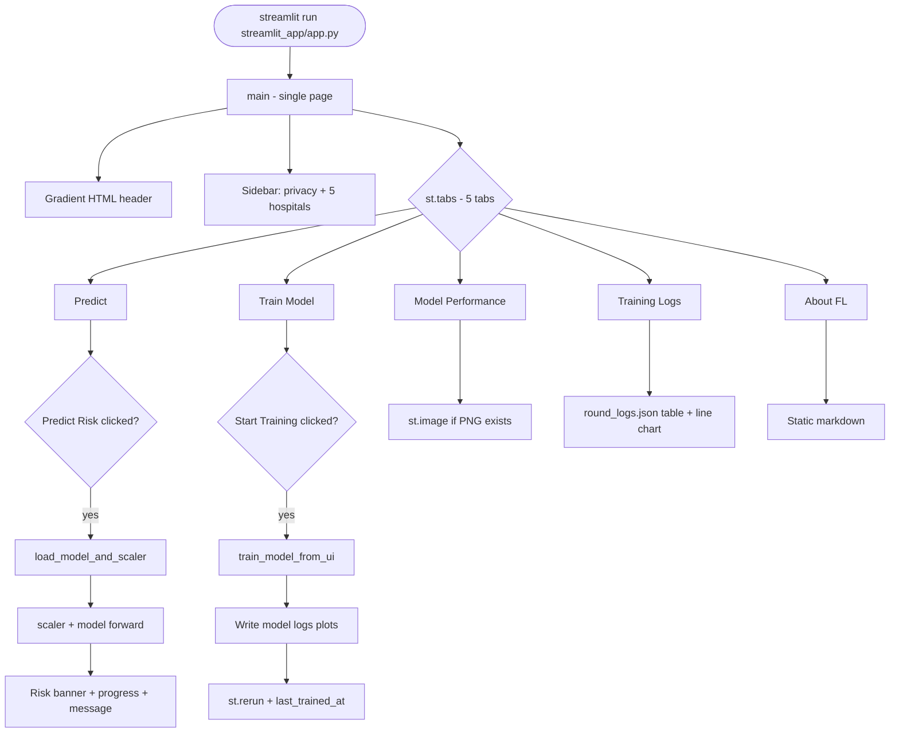
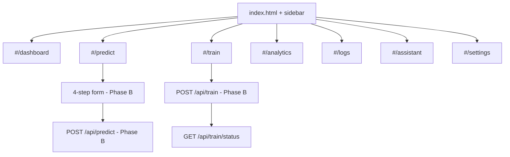

# Migration Audit: Streamlit → Vanilla HTML/CSS/JS

**Project:** `heart_disease-main` (Federated Heart Disease Risk Prediction)  
**Audit date:** 2026-05-20  
**Auditor role:** Senior frontend migration engineer  
**Scope:** Read-only audit of Streamlit app; no application code rewritten in this step.

---

## Executive Summary

| Item | Finding |
|------|---------|
| **Streamlit entry** | `streamlit_app/app.py` (~485 lines, single file) |
| **Run command** | `streamlit run streamlit_app/app.py` |
| **Current UI model** | 1 page, 5 horizontal tabs + static sidebar (not multi-page routing) |
| **ML backend** | In-process Python (PyTorch FL + inference); **no HTTP API** yet (`api/` is a stub README) |
| **Session state** | Minimal — one key: `last_trained_at` |
| **Partial migration work** | `web/` folder exists (Phase A shell: router, CSS tokens, placeholder pages) — see §1.3 |
| **Critical finding** | **Streamlit `CAT_ENCODE` labels and integer codes do not match** the CSV / `LabelEncoder` used during training (§7, R3) |
| **Migration complexity** | **High** — browser cannot run PyTorch; training/predict require a Python API; encoding must be unified before parity |

---

## 1. Feature Inventory (Page by Page)

### 1.1 Streamlit Application (As Implemented)

Navigation is **tab-based** inside one Streamlit script. There are no `st.navigation` pages or URL routes.

| Tab # | Tab label | Purpose | Key user actions |
|-------|-----------|---------|------------------|
| 0 | 🔍 Predict | Patient risk inference | 29 inputs in 3 columns → **Predict Risk** → probability, label, progress, clinical message |
| 1 | 🧠 Train Model | Federated training from UI | Preset radio, hyperparameter sliders, confirm checkbox → **Start Training** → full FL pipeline |
| 2 | 📊 Model Performance | Static plot gallery | Read-only display of PNG plots from disk |
| 3 | 📈 Training Logs | Round metrics | Load `round_logs.json` → table + loss line chart |
| 4 | ℹ️ About FL | Education | Static markdown (privacy, FedAvg, DP, references) |

**Sidebar (informational, not a route):**

| Block | Widgets | Behavior |
|-------|---------|----------|
| Privacy & Security | `st.info` | Static HIPAA/GDPR/FL copy |
| Hospital Network | 5× `st.success` | Hardcoded “Hospital-01 … Connected” (not tied to real client state) |

**Global chrome:**

- `st.set_page_config(page_title, page_icon, layout="wide")`
- Gradient HTML header via `st.markdown(..., unsafe_allow_html=True)`

---

### 1.2 Functions Outside Tabs (Same File)

| Function | Role | Invoked by |
|----------|------|------------|
| `load_model_and_scaler()` | `@st.cache_resource` — loads `scaler.pkl` + `global_model.pth` | Predict tab |
| `train_model_from_ui(...)` | Full FL pipeline + plot generation + JSON writes | Train tab |
| `main()` | Layout, tabs, all UI wiring | `streamlit run` |

---

### 1.3 Existing `web/` Scaffold (Not Streamlit — Migration In Progress)

A vanilla frontend shell already exists (likely from a prior step). It does **not** replicate Streamlit behavior yet.

| Route | File | Current state |
|-------|------|---------------|
| `/dashboard` | `web/js/pages/dashboardPage.js` | Layout + mock Chart.js from `web/data/mocks/dashboard.json` |
| `/predict` | `web/js/pages/predictPage.js` | Placeholder cards only |
| `/train` | `web/js/pages/trainPage.js` | Placeholder |
| `/analytics` | `web/js/pages/analyticsPage.js` | Placeholder |
| `/logs` | `web/js/pages/logsPage.js` | Placeholder |
| `/assistant` | `web/js/pages/assistantPage.js` | Placeholder |
| `/settings` | `web/js/pages/settingsPage.js` | Placeholder |

`web/data/encoding-manifest.json` is **empty** (stub). `CONFIG.mode` is `"mock"` in `web/js/config.js`.

**Streamlit features with no `web/` equivalent yet:** in-browser training, live predict API, logs table from `round_logs.json`, About FL content, sidebar hospital status tied to training.

---

## 2. Input/Output Mapping per Feature

### 2.1 Predict (Tab 0)

| Direction | Details |
|-----------|---------|
| **Trigger** | Button: `🔍 Predict Risk` (`type="primary"`) |
| **Inputs** | 29 widgets → `raw` dict keyed by `FEATURE_ORDER` |
| **Transform** | `numpy` vector → `scaler.transform()` → `torch.tensor` → `HeartDiseaseNet` forward (sigmoid) |
| **Outputs (UI)** | Risk %, HIGH/LOW at threshold `0.5`, colored HTML banner, `st.progress(prob)`, warning or success message |
| **Files read** | `models/global_model.pth`, `models/scaler.pkl` |
| **Errors** | `FileNotFoundError` → train first; other exceptions → `st.error` |

#### Predict — Field inventory

| Group | Streamlit widget | Feature key | UI encoding (app `CAT_ENCODE`) |
|-------|------------------|-------------|--------------------------------|
| Demographics | slider 18–100 | `age` | numeric |
| | selectbox Male/Female | `gender` | Male=1, Female=0 |
| | slider BMI | `bmi` | float |
| | checkbox | `family_history_heart_disease` | 0/1 |
| Medical | checkbox ×3 | `diabetes`, `hypertension`, `previous_heart_event` | 0/1 |
| | number_input ×6 | cholesterol, HDL, LDL, BP sys/dia, RHR, FBS | numeric |
| | selectbox ECG | `ecg_result` | Normal=0, ST-T Abnormality=1, LV Hypertrophy=2 |
| Lifestyle | selectbox smoking | `smoking_status` | Never=0, Former=1, Current=2 |
| | slider | `cigarettes_per_day` | int |
| | slider | `alcohol_units_per_week` | float |
| | selectbox activity | `physical_activity_level` | Sedentary=0 … Very Active=3 |
| | slider | `exercise_hours_per_week` | float |
| | checkbox ×2 | `walks_daily`, `plays_sport` | 0/1 |
| | slider | `sleep_hours_per_night` | float |
| | selectbox | `sleep_quality` | Poor=0, Fair=1, Good=2 |
| | slider 1–10 | `stress_level` | int |
| | checkbox | `depression_anxiety` | 0/1 |
| | selectbox | `diet_quality` | Poor=0, Fair=1, Good=2 |
| | slider | `fruit_veg_servings_per_day` | float |
| | selectbox | `salt_intake` | Low=0, Medium=1, High=2 |

**Training pipeline encoding (CSV + `LabelEncoder` in `utils/data_preprocessor.py`) differs** — see §7 / R3. Feature **order** matches (`FEATURE_ORDER` ≡ preprocessor column order).

---

### 2.2 Train Model (Tab 1)

| Direction | Details |
|-----------|---------|
| **Trigger** | `🚀 Start Training` (disabled if confirm checkbox unchecked) |
| **Inputs** | `preset`, `rounds`, `epochs`, `hospitals`, `noniid`, `dp`, `seed`, `allow_train` |
| **Presets** | Demo: 2/1/3; Balanced: 5/3/5+DP; Full: 10/5/5+DP |
| **Process** | `train_model_from_ui()` — mirrors `main.py` FL loop (no centralized baseline in UI path) |
| **Progress** | `progress_callback(pct, msg)` → `st.progress`, `st.empty().info` |
| **Outputs (UI)** | Success messages; `st.session_state["last_trained_at"]`; `st.rerun()` |
| **Side effects** | `load_model_and_scaler.clear()`; writes model, scaler, logs, summary, 3 PNGs |
| **Files written** | See §4.3 |

**Estimated time caption:** `max(8, int(rounds * epochs * hospitals * 0.7))` seconds (heuristic only).

---

### 2.3 Model Performance (Tab 2)

| Direction | Details |
|-----------|---------|
| **Inputs** | None (read-only) |
| **Files read** | `results/plots/01_training_curves.png`, `02_fed_confusion_matrix.png`, `07_feature_importance.png` |
| **Outputs** | `st.image` per file, or `st.info` prompting `python main.py` |
| **Gap** | `main.py` can generate `03`–`06`; Streamlit never displays them |

---

### 2.4 Training Logs (Tab 3)

| Direction | Details |
|-----------|---------|
| **Inputs** | None |
| **Files read** | `results/metrics/round_logs.json` |
| **Transform** | `pd.DataFrame`; hide `accuracy`, `precision`, `recall`, `f1` from table display |
| **Outputs** | Styled dataframe (4 decimal places); `st.line_chart` of `avg_client_loss` by `round` |

**Round log schema (per round):**

```json
{
  "round": 1,
  "avg_client_loss": 0.27,
  "avg_client_acc": 0.88,
  "accuracy": 0.725,
  "precision": 0.596,
  "recall": 0.977,
  "f1": 0.740
}
```

---

### 2.5 About FL (Tab 4)

| Direction | Details |
|-----------|---------|
| **Inputs/Outputs** | Static markdown only — no files, no API |

---

### 2.6 CLI Pipeline (`main.py`) — Shared Assets, Not Streamlit UI

| Direction | Details |
|-----------|---------|
| **Entry** | `python main.py [--hospitals] [--rounds] [--epochs] [--noniid] [--dp] [--fraction] [--seed]` |
| **Extra vs UI train** | Centralized baseline in `final_summary.json`; plot `03_cen_confusion_matrix.png` |
| **Same artifacts** | `global_model.pth`, `scaler.pkl`, `round_logs.json`, `final_summary.json`, plots |

---

## 3. Session State Usage Map

Streamlit session state is **minimal**. Most state is implicit widget state or server-side cache.

| Mechanism | Key / scope | Set where | Read where | Purpose | HTML/JS equivalent |
|-----------|-------------|-----------|------------|---------|-------------------|
| `st.session_state` | `last_trained_at` | After successful training (Tab 1) | Tab 1 success banner | ISO timestamp of last UI training | `sessionStorage` / app store |
| `@st.cache_resource` | `load_model_and_scaler()` | First predict load | Predict tab | In-memory model + scaler singleton | API process singleton; not in browser |
| Widget state | All predict/train controls | User interaction | Same run / rerun | Values persist across reruns within session | Form state / `sessionStorage` per wizard step |
| *(none)* | Predict results | — | — | Shown only until rerun; not stored | Dedicated result route + optional history store |

**Not used but behaviorally important:**

- No `st.session_state` for prediction history, wizard step, or selected tab index (tabs reset on full reload).
- Training progress widgets (`st.progress`, `st.empty`) are ephemeral for the training run only.

---

## 4. External Dependencies / APIs / Files

### 4.1 Python packages (`requirements.txt`)

| Package | Role in Streamlit app |
|---------|----------------------|
| `streamlit` | UI framework |
| `torch`, `torchvision` | Model train/infer |
| `scikit-learn` | Scaler, splits, `LabelEncoder` (training data path) |
| `pandas` | Logs dataframe |
| `numpy` | Feature vectors |
| `matplotlib`, `seaborn` | Offline PNG generation via `utils/visualizer.py` |
| `pickle` | Scaler persistence |

### 4.2 Internal Python modules (imported by `streamlit_app/app.py`)

| Module | Responsibility |
|--------|----------------|
| `models/heart_model.py` | `HeartDiseaseNet`, `evaluate_model` |
| `utils/data_preprocessor.py` | Load CSV, encode, partition, scaler fit/save |
| `clients/hospital_client.py` | Local training + optional DP noise (`dp_noise_multiplier=0.01`) |
| `server/federated_server.py` | FedAvg loop, logging, global model save |
| `utils/visualizer.py` | Matplotlib plots for UI training path |

### 4.3 Data and artifact files

| Path | Read/Write | Used by |
|------|------------|---------|
| `data/heart_disease_federated.csv` | Read | Training (UI + CLI); 10,000 rows, 29 features + target |
| `models/global_model.pth` | R/W | Inference, training output |
| `models/scaler.pkl` | R/W | Inference, training output |
| `results/metrics/round_logs.json` | R/W | Logs tab; chart data |
| `results/metrics/final_summary.json` | W (UI train), R/W (CLI) | `federated`/`centralized` confusion matrices + `config` |
| `results/plots/*.png` | W | Performance tab (`01`, `02`, `07` from UI train) |
| `results/project_report.html` | — | Not referenced by Streamlit |

**Note:** `results/plots/` may be empty until first training run.

### 4.4 External APIs

| API | Status |
|-----|--------|
| REST / GraphQL | **None** (planned in `api/README.md` + `ARCHITECTURE_PLAN.md`) |
| LLM / AI Assistant | **None** |
| Auth / accounts | **None** |
| Database | **None** |

### 4.5 Legacy / duplicate code (migration hygiene)

| File | Issue |
|------|-------|
| `utils/visualization.py` | Alternate plotting API (`avg_loss` vs `avg_client_loss`); **not imported** by app or `main.py` |
| `train_federated.py` | Second training entry point; overlaps `main.py` |
| `utils/visualizer.py` | `plot_federated_vs_centralized`, `plot_client_accuracy`, `plot_metrics_table` exist but are **not called** in current `main.py` loop |

---

## 5. Chart and Visualization Inventory

### 5.1 In Streamlit UI (runtime)

| ID | Component | Data source | Streamlit API |
|----|-----------|-------------|---------------|
| S1 | Risk progress bar | Prediction probability | `st.progress` |
| S2 | Training progress | `ui_progress(pct, msg)` | `st.progress`, `st.empty` |
| S3 | Loss line chart (logs tab) | `round_logs.json` → `avg_client_loss` | `st.line_chart` |
| S4 | Static images (performance tab) | PNG on disk | `st.image` |

### 5.2 Generated offline (matplotlib → PNG)

| File | Called from UI train? | Called from `main.py`? | Generator |
|------|----------------------|------------------------|-----------|
| `01_training_curves.png` | Yes | Yes | `plot_training_curves` (`avg_client_loss`) |
| `02_fed_confusion_matrix.png` | Yes | Yes | `plot_confusion_matrix` |
| `03_cen_confusion_matrix.png` | No | Yes | Centralized baseline CM |
| `04_federated_vs_centralized.png` | No | No (function exists) | — |
| `05_per_hospital_accuracy.png` | No | No (function exists) | — |
| `06_metrics_table.png` | No | No (function exists) | — |
| `07_feature_importance.png` | Yes | Yes | `plot_feature_importance` (permutation, top 15) |

### 5.3 Target vanilla JS charts (migration — Phase C)

| Chart | Suggested approach | Data source |
|-------|-------------------|-------------|
| Training loss / accuracy curves | Chart.js line | `round_logs.json` |
| Logs tab loss chart | Chart.js (replaces `st.line_chart`) | `avg_client_loss` by `round` |
| Confusion matrix | HTML grid or heatmap lib | `final_summary.json` |
| Feature importance | Chart.js horizontal bar | API or exported JSON from permutation |
| Dashboard KPIs / weekly area | Chart.js | Real metrics + optional mock until API exists |
| Risk gauge (if added in redesign) | SVG / doughnut | `POST /api/predict` response |

---

## 6. Navigation Flow

### 6.1 Current Streamlit flow



### 6.2 Proposed target flow (`web/` hash router)



### 6.3 Streamlit → route mapping checklist

- [ ] Tab 0 Predict → `#/predict` (+ optional `#/predict/result`)
- [ ] Tab 1 Train → `#/train`
- [ ] Tab 2 Performance → `#/analytics` (live charts, not only PNG)
- [ ] Tab 3 Training Logs → `#/analytics` and/or `#/logs` (activity log is new)
- [ ] Tab 4 About FL → `#/settings` or footer on `#/dashboard`
- [ ] Sidebar privacy copy → persistent panel or settings section
- [ ] Hardcoded hospital list → bind to training config / client count

---

## 7. Encoding Mismatch (Verified — Critical for Parity)

Training uses **`LabelEncoder` per column** on CSV string values (`utils/data_preprocessor.py`).  
Streamlit predict uses a **hand-written `CAT_ENCODE` dict** with **different labels and different integer mappings**.

| Column | Streamlit UI labels → codes | CSV values → LabelEncoder codes |
|--------|----------------------------|--------------------------------|
| `gender` | Male=1, Female=0 | Female=0, Male=1, Other=2 |
| `ecg_result` | Normal=0, ST-T Abnormality=1, LV Hypertrophy=2 | LVH=0, Normal=1, ST-Abnormality=2 |
| `smoking_status` | Never=0, Former=1, Current=2 | Current=0, Former=1, Never=2 |
| `physical_activity_level` | Sedentary, Lightly Active, Active, Very Active (0–3) | Active=0, Light=1, Moderate=2, Sedentary=3 |
| `sleep_quality` | Poor=0, Fair=1, Good=2 | Fair=0, Good=1, Poor=2 |
| `diet_quality` | Poor, Fair, Good (0–2) | Average=0, Healthy=1, Unhealthy=2 |
| `salt_intake` | Low=0, Medium=1, High=2 | High=0, Low=1, Medium=2 |

**Impact:** Predictions from the Streamlit UI are **not guaranteed to match** the model trained on preprocessed CSV data, even with correct numeric inputs for continuous features.

**Migration requirement:** Populate `web/data/encoding-manifest.json` (and Python API) from **one canonical source** — the training preprocessor, not the current `CAT_ENCODE` block — then align or replace Streamlit labels before claiming functional parity.

---

## 8. Risk List (Migration Breakers)

| # | Risk | Severity | Mitigation |
|---|------|----------|------------|
| R1 | PyTorch FL cannot run in vanilla JS | Critical | Python API (`POST /train`, `POST /predict`); keep `train_model_from_ui` logic server-side |
| R2 | Long sync training blocks HTTP request | High | Background job + polling/SSE (`GET /api/train/status`) |
| R3 | **UI `CAT_ENCODE` ≠ training `LabelEncoder`** (verified §7) | **Critical** | Single encoding manifest; fix Streamlit or replace with CSV-aligned labels |
| R4 | 29 features vs simplified wizard in `web/` | High | Document defaults for omitted fields; validate ranges |
| R5 | Hardcoded paths in `app.py` (`BASE`, `MODEL_PATH`, …) | Medium | Config/env in API layer |
| R6 | `@st.cache_resource` manual `.clear()` after train | Medium | API model version / `trained_at` header |
| R7 | Performance tab is static PNGs only | Medium | Phase C: JSON metrics + Chart.js; PNG as export |
| R8 | Sidebar hospitals “Connected” is decorative | Low | Drive from last training `hospitals` config |
| R9 | AI Assistant / activity Logs / Settings toggles have no backend | Medium | Phase D: mock then real contracts |
| R10 | Factor contributions / report download not in Streamlit | Medium | Optional API (SHAP/permutation) post-MVP |
| R11 | `LabelEncoder` reused across columns in preprocessor loop | Medium | Per-column encoders persisted in manifest |
| R12 | Duplicate trainers (`main.py`, `train_federated.py`) | Low | One canonical `train_service` module |
| R13 | Unused `visualization.py` field names | Low | Remove or merge to avoid `avg_loss` confusion |
| R14 | No auth; privacy copy is informational only | Low | Keep disclaimers; avoid fake security toggles |
| R15 | Windows dev: static server + Python API two processes | Low | Document in README; optional single launcher |

---

## 9. Migration Plan (Phased)

### Phase A — Core layout and routing

**Goal:** App shell, sidebar, hash routes, design tokens; no ML in browser.

| Task | Status |
|------|--------|
| `web/` folder structure (HTML, CSS tokens, ES module router) | ✅ Done |
| Sidebar + 7 routes (`#/dashboard` … `#/settings`) | ✅ Done |
| Shared components (card, button, page header, sidebar) | ✅ Partial |
| Placeholder content per route | ✅ Done |
| `UI_TOKENS.md` + CSS variables | ✅ See `UI_TOKENS.md`, `web/css/tokens.css` |

**Exit criteria:** Navigate all sections; responsive layout; zero console errors on static server.

**Remaining for Phase A:** Wire real page titles/copy from Streamlit; mobile QA; remove placeholder-only labels where confusing.

---

### Phase B — Forms and interactions

**Goal:** Predict form + Train controls; backend API for predict/train.

| Task | Status |
|------|--------|
| 4-step predict wizard + validation | ⬜ |
| Populate `encoding-manifest.json` from **training** encodings (§7) | ⬜ |
| Map wizard → 29-feature API payload | ⬜ |
| Train UI: presets, sliders, confirm checkbox (parity with Tab 1) | ⬜ |
| Python API: `POST /api/predict`, `POST /api/train`, `GET /api/train/status` | ⬜ |
| Result UI: risk %, threshold 0.5, messages (parity with Tab 0) | ⬜ |

**Exit criteria:** Predict via API matches CLI-trained model; train completes and updates artifacts; `lastTrainedAt` in client store.

---

### Phase C — Charts and analytics

**Goal:** Replace/supplement PNG gallery with live charts.

| Task | Status |
|------|--------|
| Chart.js: training curves from `round_logs.json` | ⬜ |
| Dashboard KPIs from `round_logs.json` + `final_summary.json` | ⬜ |
| Analytics: confusion matrix, feature importance | ⬜ |
| Train page live loss/accuracy during job polling | ⬜ |
| Logs tab parity: table + loss chart (hide same columns as Streamlit) | ⬜ |

**Exit criteria:** After training, dashboard/analytics reflect latest `round_logs.json`; performance tab equivalent without requiring manual PNG refresh.

---

### Phase D — AI assistant, logs, settings

**Goal:** Secondary screens + polish (beyond Streamlit today).

| Task | Status |
|------|--------|
| Activity log feed (`#/logs`) — new vs Streamlit | ⬜ |
| AI Assistant chat UI + mock or LLM API | ⬜ |
| Settings: local persistence (`localStorage`) | ⬜ |
| About FL / privacy copy from Tab 4 + sidebar | ⬜ |
| Export placeholders | ⬜ |

**Exit criteria:** All sidebar routes functional at UX level; settings persist locally; privacy education content migrated.

---

### Phase E — Hardening (recommended)

| Task | Status |
|------|--------|
| Unify encoding across Python train + API + JS | ⬜ |
| Background training worker | ⬜ |
| Error/empty/loading states on all routes | ⬜ |
| Deprecate Streamlit app when parity signed off | ⬜ |

---

## 10. File-to-Route Mapping

| Streamlit / artifact | Target route(s) |
|--------------------|-----------------|
| Tab 0 Predict | `#/predict` (+ result view) |
| Tab 1 Train | `#/train` |
| Tab 2 Performance | `#/analytics` |
| Tab 3 Training Logs | `#/analytics` + `#/logs` (extended) |
| Tab 4 About | `#/settings` or `#/dashboard` footer |
| Sidebar privacy | `#/settings` or global aside |
| `train_model_from_ui` / `main.py` | Backend train service |
| `round_logs.json` | `#/dashboard`, `#/train`, `#/analytics` |
| `final_summary.json` | `#/analytics` |
| Plot PNGs | Optional download; prefer live charts |

---

## 11. Proposed API Contracts (for later phases)

### Prediction request

```json
{
  "features": {
    "age": 55,
    "gender": 1,
    "...": "all 29 keys in FEATURE_ORDER with training-aligned codes"
  }
}
```

### Prediction response (Streamlit parity)

```json
{
  "probability": 0.68,
  "risk_pct": 68.0,
  "label": "HIGH",
  "threshold": 0.5
}
```

### Training request (matches Tab 1)

```json
{
  "rounds": 10,
  "epochs": 5,
  "hospitals": 5,
  "noniid": true,
  "dp": true,
  "seed": 42
}
```

### Training progress event

```json
{ "pct": 0.35, "message": "Running federated training rounds..." }
```

---

## 12. Step 1 Audit Checklist

- [x] Feature inventory (Streamlit tabs + sidebar)
- [x] Feature inventory (existing `web/` scaffold gap)
- [x] Input/output mapping per feature
- [x] Session state usage map
- [x] External dependencies / files / APIs
- [x] Chart/visualization inventory
- [x] Navigation flow (current + target)
- [x] Risk list (including verified encoding mismatch)
- [x] Phased migration plan (A–D + recommended E)
- [x] No application code rewritten (this document only)

---

## 13. Recommended Next Step (Step 2)

```text
Based on MIGRATION_AUDIT.md, implement Phase B starting points:
1) Fill web/data/encoding-manifest.json from training LabelEncoder mappings (§7).
2) Implement Python API stubs for predict and train per ARCHITECTURE_PLAN.md.
3) Replace predictPage.js placeholders with wizard + API adapter.
```

---

*End of migration audit — Step 1 complete. No Streamlit or ML code was modified.*
